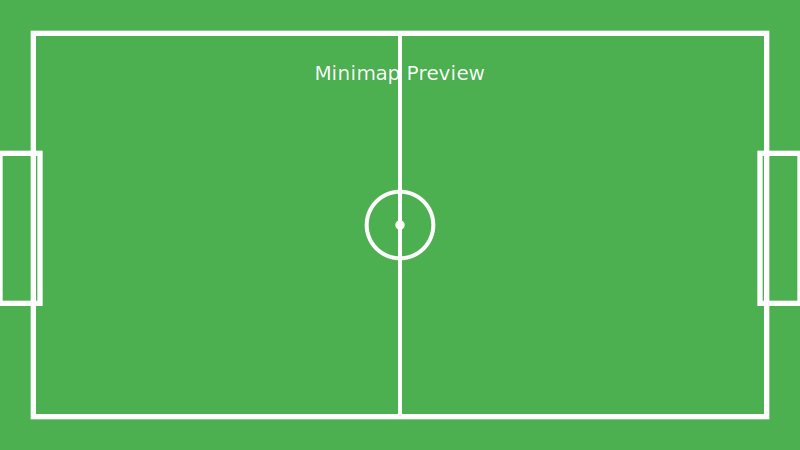
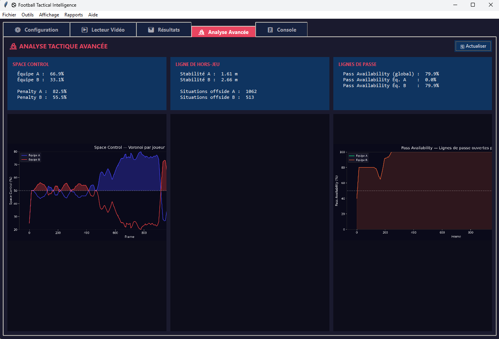

# ⚽ Football Tactical Intelligence

> Transformer un flux vidéo brut en **Intelligence Tactique** — Du *Video Analysis* au *Data Intelligence*.


---

## 🎯 Objectifs

| Objectif | Description |
|----------|-------------|
| **Digital Twin** | Jumeau numérique du match : projection caméra → vue de dessus 2D pour calculer des distances réelles |
| **Auto Scouting** | Rapport tactique automatique en 1 seconde au lieu d'heures de notation manuelle |
| **Space Control** | Diagrammes de Voronoi pour mesurer le contrôle territorial de chaque équipe |
| **Off-Ball Analysis** | Évaluation de la performance sans ballon (placement, appels de balle) |

---

## 🏗️ Architecture

```
┌─────────────────────────────────────────────────────────────┐
│                    VIDEO INPUT (match.mp4)                   │
└──────────────────────┬──────────────────────────────────────┘
                       │
          ┌────────────▼────────────┐
          │  A. Détection + Tracking │  YOLOv11 + ByteTrack
          │     (Le "Moteur")        │  → Joueurs, Ballon, Arbitre
          └────────────┬────────────┘
                       │
     ┌─────────────────┼─────────────────┐
     │                 │                 │
┌────▼─────┐    ┌──────▼──────┐   ┌──────▼──────┐
│ B. Terrain│   │C. Équipes   │   │D. Analyse   │
│ Homographie│  │K-Means Color│   │  Tactique   │
│ Pixel→Mètre│  │ A / B / Ref │   │ (Cerveau)   │
└────┬─────┘    └──────┬──────┘   └──────┬──────┘
     │                 │                 │
     └─────────────────┼─────────────────┘
                       │
          ┌────────────▼────────────┐
          │   Visualisation +       │
          │   Rapport Automatique   │
          │   • Vidéo annotée       │
          │   • Minimap 2D          │
          │   • HTML Dashboard      │
          └─────────────────────────┘
```

---

## 📁 Structure du Projet

```
video_analysis/
├── main.py                          # Pipeline principal
├── config.py                        # Configuration centralisée
├── requirements.txt                 # Dépendances
│
├── src/
│   ├── detection/
│   │   ├── detector.py              # YOLOv11 détection
│   │   └── tracker.py               # Multi-Object Tracking
│   │
│   ├── pitch/
│   │   ├── pitch_template.py        # Template terrain 2D (FIFA)
│   │   ├── segmentation.py          # Détection pelouse/lignes
│   │   └── homography.py            # Transformation perspective
│   │
│   ├── team/
│   │   └── classifier.py            # K-Means classification couleur
│   │
│   ├── analysis/
│   │   ├── spatial.py               # Voronoi, Convex Hull
│   │   ├── tactical.py              # Phases de jeu, métriques
│   │   ├── phase_detector.py        # Détection de transitions
│   │   └── report_generator.py      # Rapports auto (HTML/JSON)
│   │
│   └── visualization/
│       ├── annotator.py             # Annotations vidéo
│       ├── minimap.py               # Vue de dessus (Bird's Eye)
│       └── dashboard.py             # Graphiques mplsoccer
│
├── data/sample_videos/              # Vidéos d'entrée
├── models/                          # Poids YOLO (auto-download)
└── output/                          # Résultats
```

---

## 🚀 Installation

```bash
# Cloner le projet
cd video_analysis

# Créer un environnement virtuel
python -m venv venv
venv\Scripts\activate        # Windows
# source venv/bin/activate   # Linux/Mac

# Installer les dépendances
pip install -r requirements.txt
```

---

## 🖼️ Images & GIF

J'ai ajouté des images d'exemple sous le dossier `images/` et des scripts pour générer un GIF à partir d'une vidéo (via `ffmpeg`). Remplacez `images/preview.gif` par votre GIF final si vous en avez un.

- Aperçu statique :



- Exemple GIF (généré avec `scripts/make_gif.ps1` ou `scripts/make_gif.sh`):



Créer un GIF (Windows PowerShell):

```powershell
.
cd .\video_analysis
powershell -File scripts\make_gif.ps1 -source "data/sample_videos/match.mp4" -out "images/preview.gif" -duration 6
```

Ou (Linux / WSL / Git Bash):

```bash
bash scripts/make_gif.sh
```

Remarques:
- Installez `ffmpeg` et assurez-vous qu'il est dans le `PATH`.
- Ajustez `--start` / `-duration` / `-width` dans les scripts pour obtenir la durée et la résolution souhaitées.


## 💻 Utilisation

### Analyse basique
```bash
python main.py --video data/sample_videos/match.mp4
```

### Avec noms des équipes
```bash
python main.py --video match.mp4 --team-a "MAS" --team-b "WAC"
```

### Avec calibration manuelle (recommandé pour la précision)
```bash
python main.py --video match.mp4 --calibrate
```

### Avec Voronoi activé
```bash
python main.py --video match.mp4 --voronoi --team-a "MAS" --team-b "RCA"
```

### Mode rapide (pas d'affichage, skip frames)
```bash
python main.py --video match.mp4 --no-display --skip 2 --max-frames 3000
```

### Réutiliser une calibration
```bash
python main.py --video match2.mp4 --homography output/match1/homography.json
```

### Contrôles en temps réel
- **Q** : Quitter
- **V** : Activer/désactiver le Voronoi

---

## 📊 Sorties Générées

| Fichier | Description |
|---------|-------------|
| `{nom}_analyzed.mp4` | Vidéo annotée avec bbox, IDs, vitesses, minimap |
| `rapport_tactique.html` | Rapport HTML interactif avec graphiques |
| `rapport_tactique.json` | Export JSON pour intégration externe |
| `rapport_tactique.txt` | Rapport texte lisible |
| `tracking_stats.json` | Statistiques de tracking (distances, vitesses) |
| `dashboard/` | Graphiques mplsoccer (positions, heatmaps, etc.) |

---

## 🧠 Métriques Tactiques Calculées

### Par frame
- **Hauteur de bloc** (Haut / Médian / Bas)
- **Phase de jeu** (Pressing Haut, Bloc Médian, Contre-Attaque...)
- **Contrôle territorial** (Voronoi %)
- **Intensité du pressing** (nombre de joueurs dans le rayon)
- **Convex Hull** (surface couverte par le bloc)
- **Compacité** (écart-type des distances au centroïde)

### Par joueur
- **Distance parcourue** (km)
- **Vitesse moyenne / max** (km/h)
- **Zone de contrôle Voronoi** (m²)
- **Position moyenne** (coordonnées terrain)

### Par période
- Distribution temporelle des phases
- Évolution de la hauteur de bloc
- Domination territoriale dans le temps
- Moments de pressing intense

---

## 🔧 Stack Technique

| Composant | Outil |
|-----------|-------|
| Langage | Python 3.10+ |
| Deep Learning | PyTorch, Ultralytics (YOLO) |
| Tracking | ByteTrack (intégré via Ultralytics) |
| Vision | OpenCV |
| Analyse Spatiale | SciPy (Voronoi, ConvexHull, cKDTree) |
| Classification | scikit-learn (K-Means) |
| Visualisation | mplsoccer, Matplotlib |
| Data | NumPy, Pandas |

---

## 📐 Calibration de l'Homographie

La calibration est l'étape clé pour passer de "pixels" à "mètres". Deux méthodes :

### Méthode 1 : Manuelle (recommandée)
```bash
python main.py --video match.mp4 --calibrate
```
Cliquez sur les points visibles du terrain (coins, intersections des lignes).
Minimum 4 points requis, 8+ points pour une meilleure précision.

### Méthode 2 : Charger une calibration existante
```bash
python main.py --video match.mp4 --homography calibration.json
```

---

## 🎯 Exemple de Rapport Généré

```
════════════════════════════════════════════════════════
   RAPPORT D'ANALYSE TACTIQUE - FOOTBALL INTELLIGENCE
════════════════════════════════════════════════════════

┌─── MAS ──────────────────────────────────────────────
│  Hauteur de bloc moyenne: 58.3%
│  Surface couverte (Convex Hull): 1247.5 m²
│  Contrôle territorial (Voronoi): 53.2%
│  Compacité (spread): 14.2 m
│
│  Distribution des phases:
│    Bloc Médian           45.2% ██████████████████████
│    Bloc Haut             28.7% ██████████████
│    Pressing Haut         15.1% ███████
│    Bloc Bas              11.0% █████
│
│  Pressing intense: 15.1% du temps (227 situations)
└───────────────────────────────────────────────────────

🎯 Insights Automatiques:
→ MAS domine territorialement (53% vs 47%)
→ MAS joue haut (bloc à 58%)
→ WAC est compacte (11.8m de spread)
```

Exemple plus détaillé (extrait réel) :

```
======================================================================
   RAPPORT D'ANALYSE TACTIQUE - FOOTBALL INTELLIGENCE
======================================================================
   Date: 08/03/2026 22:51
   Durée analysée: 0.9 minutes
   Frames analysées: 1399
======================================================================

┌─── Équipe A ──────────────────────────────────────────
│
│  Hauteur de bloc moyenne: 69.7%
│  Surface couverte (Convex Hull): 993.9 m²
│  Contrôle territorial (Voronoi): 66.9%
│  Compacité (spread): 6.9 m
│
│  Distribution des phases:
│    Bloc Haut             96.1% ████████████████████████████████████████████████
│    Bloc Médian            3.9% █
│
│  Pressing intense: 0.0% du temps
│    (0 situations)
└───────────────────────────────────────────────────────

┌─── Équipe B ──────────────────────────────────────────
│
│  Hauteur de bloc moyenne: 25.1%
│  Surface couverte (Convex Hull): 704.5 m²
│  Contrôle territorial (Voronoi): 33.1%
│  Compacité (spread): 5.9 m
│
│  Distribution des phases:
│    Bloc Bas              96.1% ████████████████████████████████████████████████
│    Bloc Médian            3.9% █
│
│  Pressing intense: 6.8% du temps
│    (95 situations)
└───────────────────────────────────────────────────────

┌─── Timeline des transitions tactiques ───────────────┐
│  [00:03] Équipe A: Bloc Médian → Bloc Haut (durée: 3.2s)
│  [00:03] Équipe B: Bloc Médian → Bloc Bas (durée: 3.2s)
└───────────────────────────────────────────────────────┘

┌─── Insights Automatiques ─────────────────────────────┐
│  → Équipe A domine territorialement (67% vs 33%)
│  → Équipe A joue haut (bloc à 70%)
│  → Équipe B est très reculée (bloc à 25%)
│  → Équipe A est très compacte (6.9m)
└───────────────────────────────────────────────────────┘
```

---

## 📈 Pour le CV

Ce projet démontre :

- **Deep Learning** : YOLOv11 pour la détection temps réel
- **Computer Vision** : Homographie, segmentation, tracking
- **Géométrie Computationnelle** : Voronoi, Convex Hull, transformations projectives
- **Big Data / Time Series** : Gestion des coordonnées X,Y de 22 joueurs × 30fps × 90min
- **Expertise Métier** : Compréhension du football tactique de haut niveau
- **Data Intelligence** : Transformation de données brutes en insights actionnables
